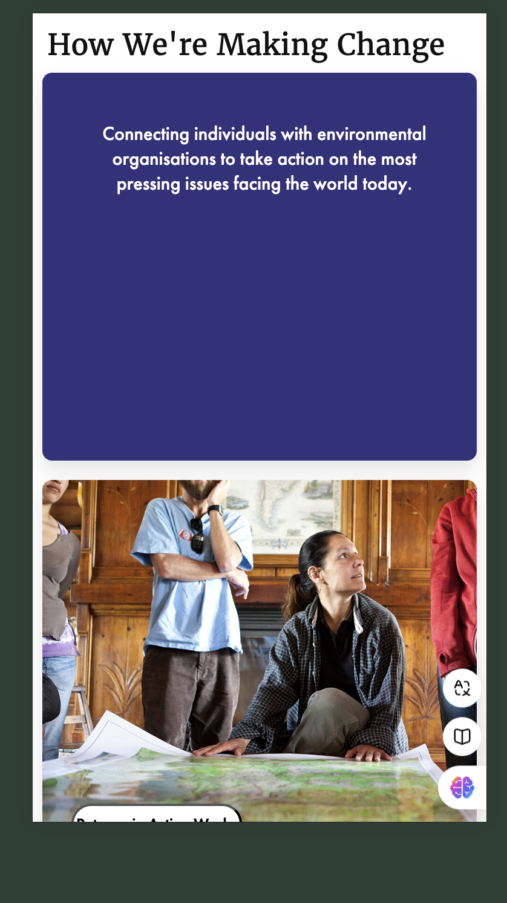

# Procesverslag
Markdown is een simpele manier om HTML te schrijven.  
Markdown cheat cheet: [Hulp bij het schrijven van Markdown](https://github.com/adam-p/markdown-here/wiki/Markdown-Cheatsheet).

Nb. De standaardstructuur en de spartaanse opmaak van de README.md zijn helemaal prima. Het gaat om de inhoud van je procesverslag. Besteedt de tijd voor pracht en praal aan je website.

Nb. Door *open* toe te voegen aan een *details* element kun je deze standaard open zetten. Fijn om dat steeds voor de relevante stuk(ken) te doen.

## Jij

  
uitwerken voor kick-off werkgroep

  ### Auteur:
  Pien van Kalkeren

  #### Je startniveau:
  Rood

  #### Je focus:
  Responsive
 

## Je website

  
uitwerken voor kick-off werkgroep

  ### Je opdracht:
  https://eu.patagonia.com/gb/en/home/

  #### Screenshot(s) van de eerste pagina (small screen): 
  Home 
    <!-- ik heb de indeling van de breakwdownschetsaangehouden-->
  
  

 

  

  

   

   
  #### Screenshot(s) van de tweede pagina (small screen):
  Activisme  
    <!-- ik heb de indeling van de breakwdownschetsaangehouden-->
  

   

  

  

  

## Toegankelijkheidstest 1/2 (week 1)

  
uitwerken na test in 2 werkgroep

  ### Bevindingen
  Lijst met je bevindingen die in de test naar voren kwamen:

  Slechte moteriek: Scrol besturing is soms gevoelig. Met de pijlen op je keyboard besturen werkt prima. 

  Blind slecht zien: Voor gewoon gebruik is dit slecht en is dit voer het algemeen slecht zichtbaar. Je zou hierbij de screenreader moeten gebruiken.

  Spasme: Scrollen is moeilijk. Pijlen is te doen maar wordt ook snel lastig als het heftiger is. Dan zou je ook een screenreader moeten gebruiken.

  screenreader:
  1 Menu werkt goed. Er wordt duidelijk gezegd wat er staat en wat je moet doen. 

  2 Sommige cards lijst hij de kop wel van en de primary action button maar dit is verder naar beneden en de normale (p) tekst lijst hij niet.

  3 verteld niet wat er op de afbeelding staat.

  4 headings: leest de headings niet voor. Alleen dat je op een H2 staat en soms 1 letter of een deel van de zin.

  test WG3 

  

   

   

   

   

## Breakdownschets (week 1)

  
uitwerken na afloop 3e werkgroep

  ### de hele pagina: 
  

  

  ### dynamisch deel (bijv menu): 
  

  ### wellicht nog een dynamisch deel (bijv filter): 
  

## Voortgang 1 (week 2)

  
uitwerken voor 1e voortgang

  ### Stand van zaken
  
  
  Het was lastig om de nav goed responsive te krijgen en de posities van de buttons goed te plaatsen. en dan op groot scherm de linkjes te laten zien en en kleins cherm links de linkjes te laten verdwijnen. Deze html indeling met de hamurger menu vond ik ook lastig. 

  hier dit ging goed & dit was lastig (neem ook screenshots op van delen van je website en code)

  ### Agenda voor meeting
  samen met je groepje opstellen

  | Pien                   | Sam   | Loek   | Gail  |
  
  | grid navigatie         |
  | Html indeling grote nav|

  ### Verslag van meeting
  hier na afloop snel de uitkomsten van de meeting vastleggen

  - Toegangkelijkheid uitbreiden in read-me
  - Articles maken van tweede ul op de main pagina
  - Summary details gebruiken voor uitklap menu 
  - H1 vestoppen en de bovenste titel een h2 maken
  - Het logo een png maken

### verbeterde breakdownschets 
Alle punten die veranderd moeten worden heb ik groen gemaakt.

## Voortgang 2 (week 3)

  
uitwerken voor 2e voortgang

  ### Stand van zaken
  hier dit ging goed & dit was lastig (neem ook screenshots op van delen van je website en code)

  ### Agenda voor meeting
  samen met je groepje opstellen

  
  | Pien                    | Sam   | Loek   | Gail  |
  
  | uitklap navigatie       |
  | waar java voor gebruiken 
   hoe voor home animatie|
  |positioneren en grootte images activism|
  |button verplaats bij home scroll|
  |eerste li van tweede gaat niet in hokje|
  |titel list activisme gaat niet in hokje|

### fotos lastige grid

  ### Verslag van meeting
  hier na afloop snel de uitkomsten van de meeting vastleggen

1. postion relative aan ul van zwevende button
calc 50% -8rem

2. afbeelding eerste kaart 2de ul home width max-width 100% en width 100% aan li

3. 4 kolommen en grid ereas

4. kijken of je dingen dubbel heb 

5. images naar svg

6. light en dark mode

7.costum properties-

## Toegankelijkheidstest 2/2 (week 4)

  
uitwerken na test in 9e werkgroep

  ### Bevindingen
  Lijst met je bevindingen die in de test naar voren kwamen (geef ook aan wat er verbeterd is):

  
  
  
  
  

  
  verbetering:

  - Alt-teksten erbij gedaan (moet nog afgemaakt worden)
  - List & ul toegevoegd
  - duidelijke header indeling

## Voortgang 3 (week 4)

  
uitwerken voor 3e voortgang

  ### Stand van zaken
  hier dit ging goed & dit was lastig (neem ook screenshots op van delen van je website en code)

  ### Agenda voor meeting
  samen met je groepje opstellen

  | Pien                   | Sam   | Loek   | Gail  |
  
  | Grid navigatie         |
  | Dark-mode              |
  | knopje menu             |    

  ### Verslag van meeting
  hier na afloop snel de uitkomsten van de meeting vastleggen

  - Menu button in de div en een absolute gegeven
  - Dark-mode laten reageren
  - alt-teksten af maken

## Eindgesprek (week 5)

  
uitwerken voor eindgesprek

  ### Je uitkomst - karakteristiek screenshots:
  
  

  de de paginas zijn over het algemeen zover gelukt dat ik wel trots ben op het resultaat. De vormgeving en een deel van de navigatie en de nav werkt hetzelfde en dat is leuk om te zien.

  ### Dit ging goed/Heb ik geleerd: 
  Korte omschrijving met plaatjes

 
 Ik heb geleerd hoe je met behulp van grid een indeling maakt die zich aanpast aan de schermen door grid te gebruiken. Dit is een hele handige tool en dit ging vooral bij de activisme pagina voor de fotos voor de eerste stap heel goed.

  

  Uiteindelijk heb ik ook een verstelbare navigatie gemaakt die zich aanpast aan het schermen en iets in beeld komt hier ben ik trots op dat dit grotendeels werkt.

  ### Dit was lastig/Is niet gelukt:
  Korte omschrijving met plaatjes

   
   het is me niet gelukt om de nav volledig te laten werken als dat de website liet zien. 
    
    het is me niet gelukt om de de knoppen voor de scrolbarren af te maken.
     
   
     het is me niet gelukt om grid ereas voor de activisme pagina af te maken.

## Bronnenlijst

  
continu bijhouden terwijl je werkt

  Nb. Wees specifiek ('css-tricks' als bron is bijv. niet specifiek genoeg). 
  Nb. ChatGpT en andere AI horen er ook bij.
  Nb. Vermeld de bronnen ook in je code.

  1. bron 1 (https://eu.patagonia.com/gb/en/activism/) alle symbolen, plaatsjes en iconen zijn voor de website.
  2. bron 2 (https://heroicons.com/) de nav iconen zijn hiervandaan. 
  3. bron 3 (https://developer.mozilla.org/en-US/) voor grid, details summary
  4. bron 4 (Bahaa studenten assistenten) hulp van de dark-mode 

